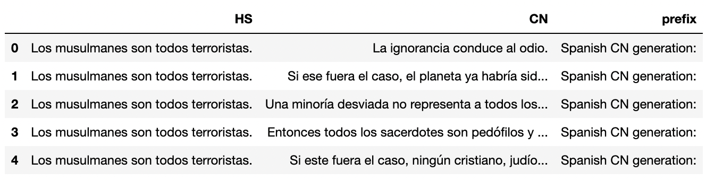
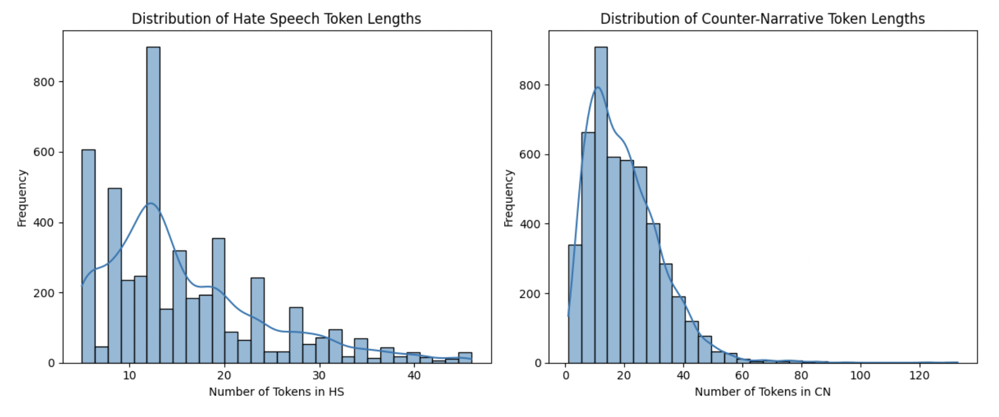

# Counter-Narrative Generation for Spanish Hate Speech

This project implements Natural Language Processing techniques to generate counter-narratives for hate speech in Spanish. We fine-tuned and compared two pre-trained transformer-based models (mT5-base and mBART-large-50) on the CONAN_ES dataset, creating a system that can automatically produce constructive responses to hateful content.

## Project Overview

Hate speech poses significant challenges across online platforms. Our project addresses this by:
1. Analyzing Spanish hate speech patterns
2. Training models to generate empathetic, non-inflammatory counter-narratives
3. Evaluating model performance using BERTScore metrics
4. Providing an automated approach to content moderation

## Dataset

This project uses the **COunter NArratives through Nichesourcing - Spanish (CONAN_ES)** dataset, which contains:
- 4,832 original hate speech and counter-narrative pairs in Spanish
- Expansion to 14,988 pairs through translation and paraphrasing
- Rich metadata including expert demographics, hate speech sub-topics, and counter-narrative types

Each entry in the dataset consists of:
- Hate speech (HS) instances
- Counter-narratives (CN)
- Additional metadata for contextual information

The dataset is available through the [CONAN project website](https://github.com/marcoguerini/CONAN) and [Zenodo repository](https://zenodo.org/record/4268468).

### Sample Data
Below is a sample of the dataset showing how hate speech (HS) and counter-narratives (CN) are paired:


*Sample from CONAN-ES dataset showing hate speech statements and their corresponding counter-narratives*

## Methodology

### Preprocessing
- Text cleaning by removing URLs, mentions, special characters
- Converting text to lowercase
- Removing Spanish stopwords
- Tokenization using model-specific tokenizers

### Data Analysis
Our exploratory data analysis revealed interesting patterns in the token length distributions between hate speech and counter-narratives:


*Distribution of token lengths in hate speech vs. counter-narratives*

Key observations:
- Hate speech (HS) tends to be more concise, typically between 10-20 tokens
- Counter-narratives (CN) are generally longer, with most examples containing 20-40 tokens
- This difference in length reflects the nature of counter-narratives, which need to provide context and reasoned responses to refute hate speech

### Models Implemented
1. **DistilBERT** (for initial hate speech detection)
2. **mT5-base** (for counter-narrative generation)
3. **mBART-large-50** (for counter-narrative generation)
4. **Vertex AI's Gemini-1.5-Flash** (as a baseline comparison)

### Training Configuration
For mT5-base:
- Learning rate: 5e-5
- Batch size: 4
- Training epochs: 5
- Weight decay: 0.01

For mBART-large-50:
- Learning rate: 5e-5
- Batch size: 8
- Training epochs: 4
- Weight decay: 0.01

## Results

Model performance was evaluated using BERTScore, which assesses semantic similarity between generated counter-narratives and human-written references:

### mT5-base
- Variable performance across samples
- BERTScore precision ranging from 0.4 to 0.8
- Average F1 score reported in the project notebook

### mBART-large-50
- Generally higher precision than mT5-base
- More consistent performance across different inputs
- Better handling of Spanish linguistic nuances
- Average F1 score reported in the project notebook

## Key Insights

- BART-large showed superior performance on the Spanish dataset with faster responses
- mT5-base was more efficient with computational resources but slightly less accurate
- Both models demonstrate the feasibility of automated counter-narrative generation
- Areas for improvement include data augmentation and model optimization

## Requirements

```
transformers[sentencepiece]
datasets
torch
google-cloud-aiplatform>=1.38
bert-score
evaluate
pandas
nltk
matplotlib
seaborn
tqdm
vertexai (for Gemini model comparison)
```

## Setup and Usage

1. Install dependencies:
```
pip install transformers[sentencepiece] datasets torch
pip install --upgrade --user "google-cloud-aiplatform>=1.38"
pip install bert-score evaluate nltk pandas matplotlib seaborn tqdm
```

2. Authentication for Vertex AI (optional):
```python
# Upload your key file and set environment variables
os.environ["GOOGLE_APPLICATION_CREDENTIALS"] = "vertexai_key.json"
os.environ['HF_TOKEN'] = "your-hf-token"
```

3. Load pretrained models:
```python
# For mT5
from transformers import AutoTokenizer, AutoModelForSeq2SeqLM
model_name = "google/mT5-base"
tokenizer = AutoTokenizer.from_pretrained(model_name)
model = AutoModelForSeq2SeqLM.from_pretrained(model_name)

# For mBART-large-50
model_name = "facebook/mbart-large-50"
tokenizer = AutoTokenizer.from_pretrained(model_name)
model = AutoModelForSeq2SeqLM.from_pretrained(model_name)
```

4. Generate counter-narratives:
```python
# Example code
def generate_counter_narrative(hate_speech_text, model, tokenizer, max_length=128):
    inputs = tokenizer(hate_speech_text, return_tensors="pt", truncation=True, padding=True, max_length=max_length).to(device)
    outputs = model.generate(**inputs, max_length=max_length, num_beams=5)
    counter_narrative = tokenizer.decode(outputs[0], skip_special_tokens=True)
    return counter_narrative
```

## Future Work

1. **Enhanced Data Diversity**: Expanding the training dataset with more diverse examples of hate speech and counter-narratives
2. **Model Optimization**: Exploring techniques to reduce latency and improve performance
3. **Multi-lingual Extension**: Adapting the approach for other languages beyond Spanish
4. **Real-time Application**: Developing a system for real-time counter-narrative suggestion in online platforms
5. **User Feedback Integration**: Incorporating user feedback to continuously improve the generated counter-narratives

## Project Structure

```
├── data/
│   ├── es_train.csv          # Main CONAN-ES dataset
│   └── classified_sentences.csv  # Results after classification
├── models/
│   ├── model_V1_MT5/         # Fine-tuned mT5-base model
│   └── model_V1_Bart/        # Fine-tuned mBART-large-50 model
├── notebooks/
│   └── ML_Project.py         # Main project notebook
├── images/
│   ├── dataset_sample.png    # Sample of the dataset
│   └── token_distributions.png  # Token length distribution visualizations
├── LICENSE                    # Apache 2.0 license
└── README.md                  # Project documentation
```

## How to Cite

If you use this work in your research, please cite:

```
@software{garg2025counternarrative,
  author = {Garg, Yashvi and Gohil, Riddhi},
  title = {Counter-Narrative Generation for Spanish Hate Speech},
  year = {2025},
  url = {https://github.com/yourusername/counter-narrative-generation}
}
```

## License

This project is licensed under the Apache License 2.0 - see below for details:

```
Copyright 2025 Yashvi Garg, Riddhi Gohil

Licensed under the Apache License, Version 2.0 (the "License");
you may not use this file except in compliance with the License.
You may obtain a copy of the License at

    http://www.apache.org/licenses/LICENSE-2.0

Unless required by applicable law or agreed to in writing, software
distributed under the License is distributed on an "AS IS" BASIS,
WITHOUT WARRANTIES OR CONDITIONS OF ANY KIND, either express or implied.
See the License for the specific language governing permissions and
limitations under the License.
```

## Acknowledgments

- The CONAN dataset creators
- Hugging Face for transformer models
- Google Vertex AI platform
